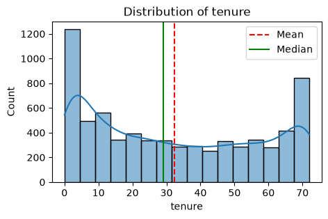
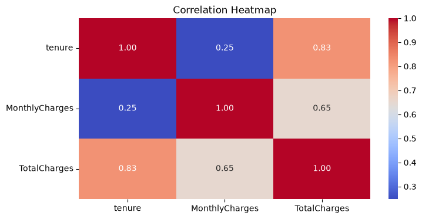
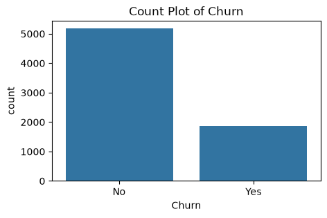

# Customer Churn Prediction

Predicts whether a telecom customer will churn, using the IBM Telco Customer Churn dataset (7,043 customers, 21 features).

## Problem
Telecom companies lose recurring revenue when customers cancel service ("churn"). This model flags at-risk customers from their profile and usage data so retention efforts can be targeted.

## Dataset
- Source: [Kaggle - Telco Customer Churn](https://www.kaggle.com/datasets/blastchar/telco-customer-churn)
- 7,043 rows, 21 columns (demographics, account info, services subscribed, charges, churn label)
- Target: `Churn` (Yes/No) — ~26.5% churn rate (imbalanced)

## Pipeline
1. **Load & clean** (`data/data.csv`)
   - Dropped `customerID` (identifier, no predictive value)
   - `TotalCharges` had blank strings for new customers (tenure=0) — cast to float, filled blanks with 0.0
2. **EDA**
   - Histograms + boxplots on `tenure`, `MonthlyCharges`, `TotalCharges`
   - Correlation heatmap of numeric features
   - Countplots for all categorical features
   - 
   - 
   - 
3. **Encoding**
   - All categorical (object dtype) columns label-encoded with `sklearn.LabelEncoder`
   - Encoders saved per-column in `encoder.pkl` (needed to transform new raw input at inference time — same encoding must be reapplied, not refit)
4. **Train/test split**
   - 80/20 split, `random_state=42`
   - Target renamed internally to binary `Curn` column (1=Yes, 0=No) — kept `Churn` original column, dropped both from feature set `X`
5. **Class imbalance**
   - Applied **SMOTE** on the training set only (never on test set — would leak synthetic patterns into evaluation)
6. **Model comparison** (5-fold cross-validation, accuracy scoring)
   - Decision Tree, Random Forest, XGBoost

### Model comparison (5-fold CV accuracy)
rainng  DecisionTreeClassifier
Cross Validation Accuracy:  0.7816695856502766
..................................................
Trainng  RandomForestClassifier
Cross Validation Accuracy:  0.8413614139556607
..................................................
Trainng  XGBoost
Cross Validation Accuracy:  0.8295220164338776
..................................................
7. **Final model**
   - Random Forest (`random_state=42`) trained on SMOTE-balanced training data
   - Saved to `model.pkl` as `{"model": rfc, "features_name": [...]}`

## Results (test set, unseen data)
- Accuracy: ~77%

### Final model (Random Forest) — test set performance
Accuracy Score:  0.7750177430801988
              precision    recall  f1-score   support

           0       0.85      0.85      0.85      1036
           1       0.58      0.57      0.57       373

    accuracy                           0.78      1409
   macro avg       0.71      0.71      0.71      1409
weighted avg       0.77      0.78      0.77      1409

[[878 158]
 [159 214]]
- Class 1 (churn) recall/precision are meaningfully lower than class 0 — expected given imbalance; this is the number to improve first if extending the project (cost-sensitive threshold tuning, better features, or trying gradient boosting more seriously)

## Files
- `notebook.ipynb` — full analysis: EDA → preprocessing → model training → evaluation
- `model.pkl` — trained Random Forest + expected feature column order
- `encoder.pkl` — fitted LabelEncoders per categorical column (required before calling predict on new raw data)
- `inference.py` — loads both pkl files and predicts on a new customer record

## How to run inference
```bash
python inference.py
```
Edit the `sample_customer` dict in `inference.py` with real values to test a different customer.

## Known limitations / next steps
- LabelEncoder is used instead of OneHotEncoder — fine for tree-based models (RF/XGBoost don't assume ordinal relationships the way linear models would), but worth noting if extending to logistic regression
- No hyperparameter tuning done yet (default `RandomForestClassifier` params) — GridSearchCV/RandomizedSearchCV is the natural next step
- Evaluation metric is plain accuracy/F1 — doesn't reflect that a false negative (missed churner) costs more than a false positive (unnecessary retention offer); a profit-sensitive metric would be a stronger CV differentiator